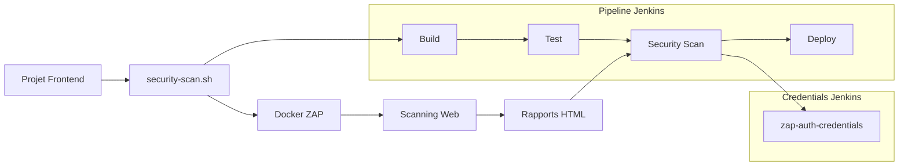

# Guide Utilisateur - Scanner de Sécurité Frontend

## Vue d'ensemble

Ce guide décrit l'utilisation du scanner de sécurité OWASP ZAP pour les applications web frontend dans l'environnement corporate Creative.

## Architecture



## Prérequis

### Infrastructure
- Connexion VPN corporate active
- Accès au registry Docker: `srv-nexus:18444`
- Application web déployée et accessible

### Outils Requis
- Bash (Linux/macOS/WSL)
- Docker (pour tests locaux)
- Accès Jenkins (pour CI/CD)

## Installation et Configuration

### 1. Structure du Projet

Créez la structure suivante dans votre projet frontend:

```
votre-projet-frontend/
├── .platforms/
│   └── ci/
│       └── security-scan.sh    # Script principal
├── src/                        # Code source
├── public/                     # Assets statiques
└── package.json               # Configuration npm
```

### 2. Script security-scan.sh

Copiez le script suivant dans `.platforms/ci/security-scan.sh`:

```bash
#!/bin/bash
# security-scan.sh - Scanner de sécurité frontend
source .platforms/bootstrap.sh

SCANNER_IMAGE="srv-nexus:18444/outillage/zaproxy:stable"
PROJECT_NAME="mon-projet-frontend"

# Configuration des URLs par environnement
case "${1:-develop}" in
    "prod"|"production")
        APP_URL="https://mon-app.groupe-creative.fr/"
        ;;
    "demo")
        APP_URL="https://demo.mon-app.minds.k8s/"
        ;;
    "valid")
        APP_URL="https://valid.mon-app.minds.k8s/"
        ;;
    "int"|"integration")
        APP_URL="https://int.mon-app.minds.k8s/"
        ;;
    *)
        echo "❌ Environnement inconnu: ${1}"
        echo "Disponibles: prod, demo, valid, int"
        exit 1
        ;;
esac
```

### 3. Configuration des Environnements

Modifiez les URLs selon vos environnements:

```bash
# Exemple pour un projet React
"prod")
    APP_URL="https://myapp.groupe-creative.fr/"
    ;;
"staging")
    APP_URL="https://staging.myapp.minds.k8s/"
    ;;
```

## Configuration Jenkins

### 1. Credentials d'Authentification

#### Créer les Credentials

1. Aller dans **Jenkins → Manage Jenkins → Manage Credentials**
2. Sélectionner le domaine approprié (Global ou projet)
3. Cliquer **Add Credentials**

#### Type: Username with password

```
ID: zap-auth-credentials
Username: [nom-utilisateur-auth]
Password: [mot-de-passe-auth]
Description: Credentials pour scanner de sécurité ZAP (Frontend)
```

**Note**: Ces credentials sont utilisés si votre application frontend nécessite une authentification pour accéder aux pages protégées.

### 2. Configuration du Pipeline

#### Jenkinsfile

Ajoutez le stage suivant dans votre Jenkinsfile:

```groovy
stage("Security Test (Frontend)") {
    if (!skipZAP && !skipScan) {
        boolean zapError = false
        try {
            withCredentials([
                usernamePassword(credentialsId: 'zap-auth-credentials',
                               usernameVariable: 'ZAP_USERNAME',
                               passwordVariable: 'ZAP_PASSWORD')
            ]) {
                println "Lancement du scan de sécurité frontend: ${deployTo}"
                sh("bash .platforms/ci/security-scan.sh ${deployTo}")
            }
        } catch (err) {
            zapError = true
            println "Échec du scan de sécurité: ${err.getMessage()}"
        } finally {
            // Archiver les rapports
            archiveArtifacts artifacts: 'security-reports/**/*',
                           allowEmptyArchive: true, excludes: null

            // Publier le rapport HTML
            if (fileExists('security-reports/index.html')) {
                JenkinsService.instance().publishHtml("./security-reports/", "SecurityReport")
            }

            if (zapError) {
                String url = JenkinsService.instance().getJobUrl() + "/SecurityReport/"
                JenkinsService.instance().setStageAsUnstable("Test Sécurité - Problèmes détectés > ${url}")
            } else {
                println "✅ Scan de sécurité frontend terminé avec succès"
            }
        }
    }
}
```

#### Paramètres Pipeline

Ajoutez les paramètres suivants:

```groovy
parameters {
    booleanParam(name: 'SKIP_ZAP', defaultValue: false,
                description: 'Ignorer le scan de sécurité frontend')
    booleanParam(name: 'SKIP_SCAN', defaultValue: false,
                description: 'Ignorer tous les scans de sécurité')
}
```

## Utilisation

### 1. Execution Locale (Tests)

```bash
# Test de connectivité
./platforms/ci/security-scan.sh test valid

# Scan complet
./platforms/ci/security-scan.sh valid
```

### 2. Via Jenkins Pipeline

1. Déclencher le pipeline normalement
2. Le stage "Security Test" s'exécute automatiquement
3. Consulter les rapports générés

### 3. Commandes Disponibles

```bash
# Afficher l'aide
./platforms/ci/security-scan.sh help

# Afficher la configuration
./platforms/ci/security-scan.sh config

# Scanner un environnement spécifique
./platforms/ci/security-scan.sh prod
./platforms/ci/security-scan.sh demo
./platforms/ci/security-scan.sh valid
```

## Types de Scans Effectués

### 1. Spider (Découverte)

- Exploration automatique des liens
- Détection des formulaires
- Mapping de l'application
- Patterns NextJS/React automatiques

### 2. Scan Actif

- Test des vulnérabilités OWASP Top 10
- Injection SQL
- Cross-Site Scripting (XSS)
- Failles d'authentification
- Configuration de sécurité

### 3. Patterns Frontend Détectés

```bash
# Patterns communs
- "/"
- "/login"
- "/dashboard"
- "/admin"
- "/profile"

# Patterns NextJS
- "/_next/static/"
- "/api/hello"
- "/_next/image"
```

## Rapports Générés

### Structure des Rapports

```
security-reports/
├── index.html              # Rapport principal HTML
├── report.xml              # Rapport XML (CI/CD)
├── alerts.json             # Alertes au format JSON
├── discovered_urls.txt     # URLs découvertes
└── summary.txt             # Résumé du scan
```

### Interprétation des Résultats

#### Niveaux de Risque

| Niveau | Couleur | Action Requise |
|--------|---------|----------------|
| High | 🔴 Rouge | **Correction immédiate** |
| Medium | 🟡 Jaune | Correction avant prod |
| Low | 🔵 Bleu | Correction recommandée |
| Info | ⚪ Gris | Information seulement |

#### Exemples d'Alertes Courantes

```
High Risk:
- SQL Injection
- Cross-Site Scripting (Stored)
- Remote Code Execution

Medium Risk:
- Cross-Site Scripting (Reflected)
- Missing Security Headers
- Weak Authentication

Low Risk:
- Information Disclosure
- Missing Secure Flag
- Clickjacking
```

### Accès aux Rapports Jenkins

1. Aller dans le build Jenkins
2. Cliquer sur **"SecurityReport"** dans la sidebar
3. Naviguer dans le rapport HTML interactif

## Authentification

### Applications avec Login

Si votre frontend nécessite une authentification:

```bash
# Les credentials Jenkins sont automatiquement utilisés
ZAP_USERNAME → Nom d'utilisateur de test
ZAP_PASSWORD → Mot de passe de test
```

### Applications Publiques

Pour les applications entièrement publiques:
- Aucun credential requis
- Le scan s'effectue en mode anonyme

### OAuth2/OIDC

Pour les applications avec OAuth2:
```bash
# Configuration dans security-scan.sh
AUTH_URL="https://sso.minds.k8s/auth/realms/creative/protocol/openid-connect/token"
```

## Bonnes Pratiques

### 1. Configuration Environnements

```bash
# Production - Scan conservateur
- Profondeur limitée
- Durée réduite
- Patterns essentiels seulement

# Développement - Scan complet
- Exploration approfondie
- Tous les patterns
- Durée étendue
```

### 2. Gestion des Faux Positifs

```bash
# Créer un fichier .zap-exclusions
echo "Ignore: Clickjacking on /public/assets/*" >> .zap-exclusions
```

### 3. Performance

```bash
# Optimisations pour gros sites
MAX_DEPTH=3          # Limiter la profondeur
MAX_DURATION=15      # Timeout en minutes
THREADS=2            # Nombre de threads
```

## Dépannage

### Problèmes Courants

#### 1. Application Non Accessible

```bash
# Vérifier la connectivité
curl -v https://votre-app.com

# Vérifier le VPN
ping minds.k8s
```

#### 2. Échec d'Authentification

```bash
# Vérifier les credentials Jenkins
echo "Username: $ZAP_USERNAME"
echo "Password: [MASKED]"

# Tester l'authentification manuellement
curl -X POST -d "username=$ZAP_USERNAME&password=$ZAP_PASSWORD" https://votre-app.com/login
```

#### 3. Permissions de Fichiers

```bash
# Corriger les permissions
sudo chown -R $(id -u):$(id -g) ./security-reports
```

#### 4. Timeout de Scan

```bash
# Réduire la portée du scan
MAX_DURATION=10     # Réduire le timeout
MAX_DEPTH=2         # Réduire la profondeur
```

### Logs de Debug

```bash
# Activer le mode debug
export ZAP_DEBUG=true
./platforms/ci/security-scan.sh valid
```

## Limitations

### Techniques
- **Réseau**: Nécessite connexion VPN corporate
- **Performance**: Impact sur l'application pendant le scan
- **Couverture**: Applications SPA complexes partiellement supportées

### Fonctionnelles
- **Auth**: Support limité aux authentifications simples
- **JS**: Applications entièrement JavaScript limitées
- **Contenu**: Contenu généré dynamiquement peut être manqué

### Environnements
- **Production**: Scan conservateur pour éviter l'impact
- **Maintenance**: Éviter pendant les fenêtres de maintenance

## Support et Ressources

### Contacts
- **DevSecOps**: devsecops@groupe-creative.fr
- **Support**: support-ci@groupe-creative.fr

### Documentation
- [OWASP ZAP User Guide](https://www.zaproxy.org/getting-started/)
- [Confluence Corporate](https://confluence.corporate/security)
- [Bonnes Pratiques Sécurité](https://wiki.corporate/security-best-practices)

### Formation
- **Session ZAP**: Formation interne trimestrielle
- **OWASP Training**: Ressources externes disponibles
